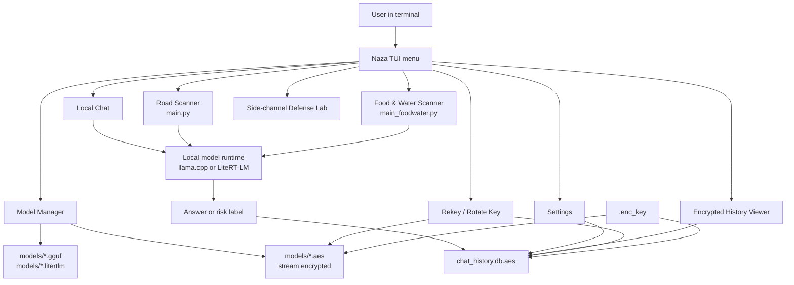
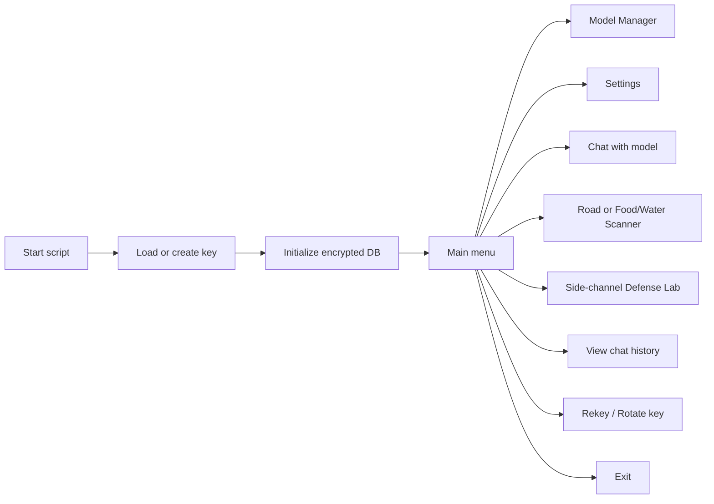
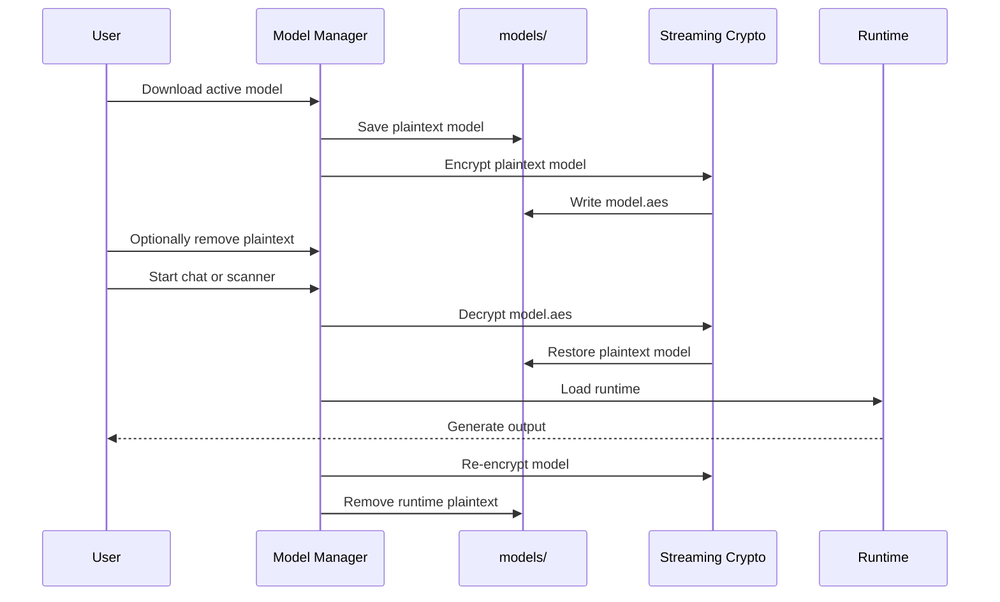
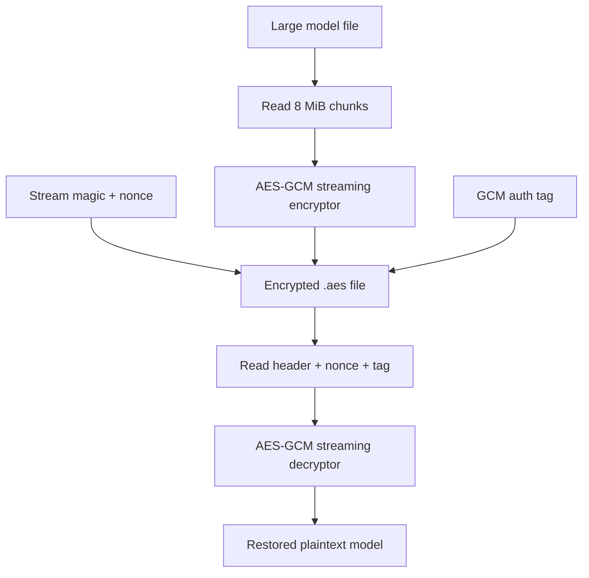
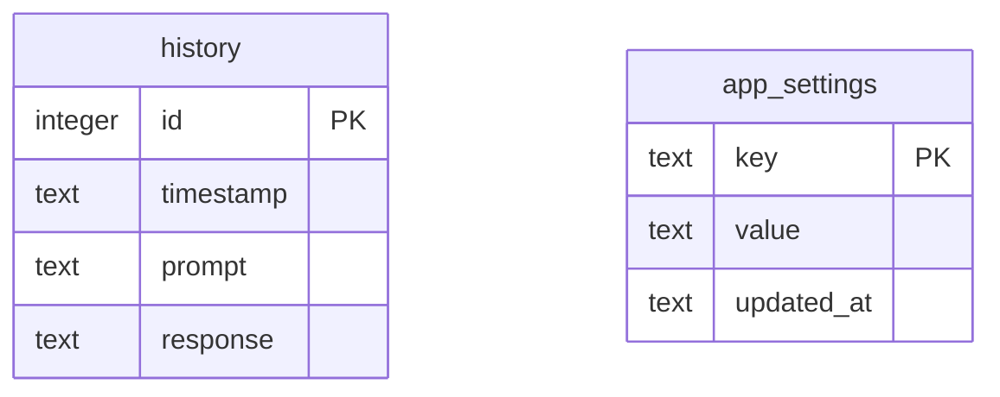
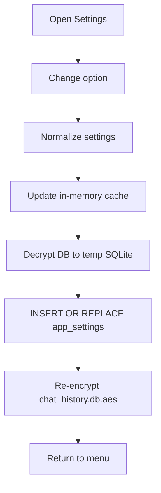
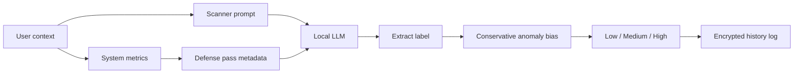
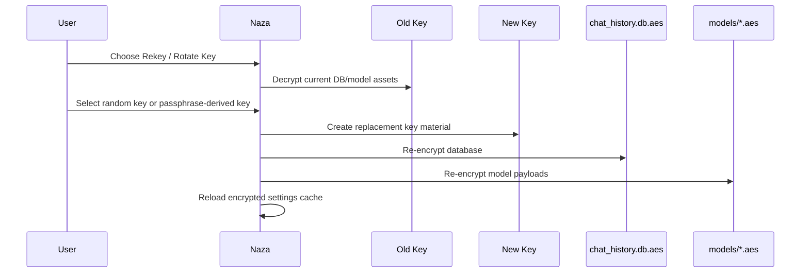
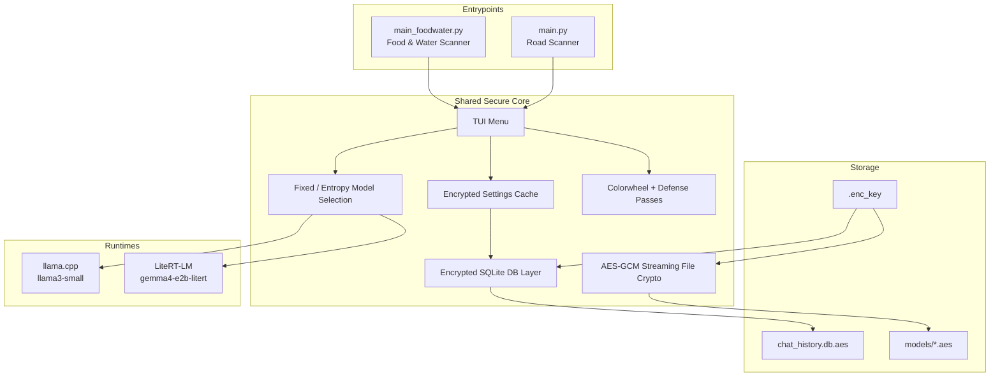

# Naza — Quantum-Enhanced Road Scanner & Secure LLM CLI


# Naza Secure Local LLM Suite

Naza is a local-first, encrypted command-line AI workspace for running compact language
models against safety-oriented scanners and private chat workflows. The current setup has
two main entrypoints:

- `main.py`: secure chat plus Road Scanner.
- `main_foodwater.py`: secure chat plus Food & Water Scanner.

Both scripts share the same secure model manager, encrypted history database, encrypted
settings store, model selection controls, rekey workflow, and side-channel defense lab.

> Current model menu: `llama3-small` and `gemma4-e2b-litert`.
> The removed Llama 3.2 1B profile is no longer offered by the code, even if old model
> files remain on disk.

---

## Highlights

- Local LLM chat with encrypted history.
- Road risk classification in `main.py`.
- Food and water supply classification in `main_foodwater.py`.
- Encrypted model storage with streaming AES-GCM for large model files.
- Optional OQS hybrid wrapping when `liboqs-python` is available.
- Encrypted SQLite database for chat history and all app settings.
- Model enable/disable controls and entropy-based model selection.
- Rekey / key rotation support for stored assets.
- Colorwheel entropy and side-channel jitter controls.
- Termux-friendly shape for Android workflows.

---

## System Map



---

## Repository Layout

| Path | Purpose |
| --- | --- |
| `main.py` | Road Scanner, secure chat, model manager, settings, history, rekey. |
| `main_foodwater.py` | Food & Water Scanner variant with the same secure infrastructure. |
| `models/` | Plaintext model files and encrypted `.aes` model payloads. |
| `chat_history.db.aes` | Encrypted SQLite database for history and app settings. |
| `.enc_key` | Local encryption key or salt+derived key material. Keep private. |
| `requirements.txt` | Pinned Python dependencies. |
| `requirements.in` | Human-readable dependency inputs. |
| `demonaza.png` | Existing project screenshot/art asset. |

Legacy plaintext settings files may still exist:

- `.selected_model`
- `.model_selection_mode`
- `.naza_security_settings.json`
- `.naza_colorwheel_state.json`

Those files are now migration fallback only. The active settings store is inside
`chat_history.db.aes`.

---

## Quickstart

Use the existing virtual environment if it is already present:

```bash
source venv/bin/activate
python main.py
```

Food and water scanner:

```bash
source venv/bin/activate
python main_foodwater.py
```

Fresh install from requirements:

```bash
python3 -m venv venv
source venv/bin/activate
pip install --upgrade pip
pip install -r requirements.txt
```

---

## Main Menu



`main.py` uses `Road Scanner`.

`main_foodwater.py` uses `Food Water Scanner`.

Everything else is intentionally shared between both scripts.

---

## Supported Models

| ID | Runtime | File | Notes |
| --- | --- | --- | --- |
| `llama3-small` | `llama.cpp` | `llama3-small-Q3_K_M.gguf` | Tiny GGUF model for lightweight local chat/scans. |
| `gemma4-e2b-litert` | `LiteRT-LM` | `gemma-4-E2B-it.litertlm` | Larger LiteRT-LM model. Uses streaming encryption cleanly. |

The app can select a fixed model or choose from enabled encrypted models using entropy.
Disabled models are excluded from chat, scans, and entropy-random selection.

---

## Model Lifecycle



Plaintext models are runtime working files. The durable copy should be the encrypted
`.aes` file.

---

## Streaming Encryption

Large models cannot safely be passed to one-shot `AESGCM.encrypt()` because that API has
an input limit. Naza uses a streaming AES-GCM container for file encryption.



Streaming payload markers:

| Marker | Meaning |
| --- | --- |
| `NAZA-AES-GCM-STREAM-v1` | Standard streaming AES-GCM encrypted file. |
| `NAZA-OQS-HYBRID-STREAM-v1` | Streaming AES-GCM with OQS-derived file key. |

Small payloads, such as the database and wrapped metadata, still use the compact legacy
AES-GCM format.

---

## Encrypted Database

`chat_history.db.aes` is an encrypted SQLite database. It stores conversation history and
application settings.



Current encrypted settings keys:

| Key | Value |
| --- | --- |
| `security_settings` | JSON object for defense profile, colorwheel, voting, jitter, and model enablement. |
| `selected_model_id` | Active fixed model ID. |
| `model_selection_mode` | `fixed` or `entropy`. |
| `colorwheel_state` | Current colorwheel entropy state. |

On startup, both scripts:

1. Load `.enc_key`.
2. Decrypt or create `chat_history.db.aes`.
3. Ensure `history` and `app_settings` exist.
4. Migrate legacy plaintext settings into `app_settings` with `INSERT OR IGNORE`.
5. Read active settings from the encrypted DB.

---

## Settings Flow



Settings writes no longer update plaintext settings files. The old files only help the
first encrypted DB migration or recovery.

---

## Scanner Workflows

### Road Scanner (`main.py`)

The road scanner asks for location and road context, builds a conservative prompt, runs
one or more defense passes, and returns:

```text
Low | Medium | High
```

### Food & Water Scanner (`main_foodwater.py`)

The food/water scanner uses the same secure runtime pipeline but asks supply-chain and
basic-resource questions instead of road-risk questions. It also returns a compact risk
classification.



---

## Security Model

Naza is designed around local execution and encrypted-at-rest project state.

| Asset | Storage | Protection |
| --- | --- | --- |
| Chat history | `chat_history.db.aes` | AES-GCM encrypted SQLite. |
| App settings | `chat_history.db.aes`, `app_settings` table | Same encrypted DB as history. |
| Model files | `models/*.aes` | Streaming AES-GCM, optional OQS hybrid file key. |
| Key material | `.enc_key` | Local key file or passphrase-derived key. |
| Temporary DB | `/tmp/chat_history_*.db` | Deleted after re-encryption. |
| Temporary plaintext model | `models/<model file>` | Removed after runtime cleanup when selected. |

Recommended hygiene:

- Keep `.enc_key` private.
- Keep encrypted `.aes` model files as the durable model copies.
- Remove plaintext model files after encryption unless you are actively debugging runtime loading.
- Back up `chat_history.db.aes` and `.enc_key` together.
- If using passphrase-derived keys, use a high-entropy passphrase.

---

## Rekey Workflow



After rekey, the app refreshes:

- `security_settings`
- `selected_model`
- `model_selection_mode`

from the encrypted DB under the new key.

---

## Android / Termux Notes

The original README includes a Termux-oriented auto-setup path. For manual workflows,
the general shape is:

```bash
pkg update -y
pkg install -y git python clang cmake
git clone <your repo url>
cd naza
python3 -m venv venv
source venv/bin/activate
pip install -r requirements.txt
python main.py
```

LiteRT-LM and llama.cpp builds can be platform-sensitive. If install time is long, that
is usually dependency compilation rather than Naza itself.

---

## Operational Runbook

### First run

1. Start `python main.py` or `python main_foodwater.py`.
2. Let the app create or load `.enc_key`.
3. Open Model Manager.
4. Select a model.
5. Download it if needed.
6. Encrypt it.
7. Remove plaintext when prompted if you do not need it.
8. Start chat or scanner.

### Switch model

1. Open Model Manager.
2. Choose Select Model.
3. Pick `llama3-small` or `gemma4-e2b-litert`.

### Use entropy selection

1. Open Model Manager.
2. Toggle selection mode to `entropy`.
3. Ensure both desired models are enabled in Settings.
4. Run chat or scanner.

### Disable a model

1. Open Settings.
2. Choose Model enable / disable controls.
3. Toggle the model.
4. At least one model must stay enabled.

---

## Troubleshooting

| Symptom | Likely cause | Fix |
| --- | --- | --- |
| `OverflowError: Data or associated data too long` | Old one-shot model encryption path. | Use the current code with streaming file encryption. |
| Model does not appear in menu | It is not in `MODEL_PROFILES` or is disabled. | Check Settings and current supported model list. |
| Gemma runtime missing | LiteRT-LM package unavailable. | Install matching `litert-lm` dependency in the active venv. |
| llama.cpp import fails | `llama-cpp-python` missing or build failed. | Reinstall from `requirements.txt` inside the venv. |
| History unreadable after rekey | Wrong `.enc_key` for the DB. | Restore matching `.enc_key` and `chat_history.db.aes` backup pair. |
| Settings seem stale | Old plaintext files are present. | Active settings come from encrypted DB after startup; update settings in the app menu. |
| Plaintext model still on disk | User chose not to delete it or runtime cleanup failed. | Re-encrypt through Model Manager, then remove plaintext only when ready. |

---

## Developer Checks

Compile both entrypoints:

```bash
venv/bin/python -m py_compile main.py main_foodwater.py
```

Verify encrypted settings table:

```bash
venv/bin/python - <<'PY'
import sqlite3
from pathlib import Path
import main

key_data = main.KEY_PATH.read_bytes()
key = key_data[16:48] if len(key_data) >= 48 else key_data[:32]
check = Path('/tmp/naza_settings_check.db')

try:
    main._decrypt_db_to_path(key, check)
    with sqlite3.connect(check) as conn:
        print(conn.execute('SELECT key FROM app_settings ORDER BY key').fetchall())
finally:
    try:
        check.unlink()
    except FileNotFoundError:
        pass
PY
```

Expected settings keys:

```text
colorwheel_state
model_selection_mode
security_settings
selected_model_id
```

---

## Current Architecture In One Picture



---

## Philosophy

Naza keeps the useful parts local: prompts, history, model choices, settings, and model
artifacts are designed to live on your machine. The encrypted DB keeps the operational
state together, while the model manager keeps large model payloads encrypted at rest and
briefly decrypted only when the runtime needs them.

The result is a compact local AI toolkit with a clear security boundary:

```text
local key + encrypted DB + encrypted models + explicit runtime loading
```

That is the shape to preserve as the project grows.


## Android OS Installation and Usage

1. Install Termux from the Play Store 
   https://play.google.com/store/apps/details?id=com.termux
   
2. Download and Run the Setup script by copying the one line command below into Termux and pressing enter.
   
```
curl -fsSL https://raw.githubusercontent.com/ornab74/naza/main/termux-naza-autosetup/setup.sh -o setup.sh && \
if echo "422c2471b038c0c99551d6203a76997c60190ce0572158f17c2ae3187fb0b0a5  setup.sh" | sha256sum -c - >/dev/null 2>&1; then
  echo -e "\nHash verified! Running Naza auto-setup...\n"
  bash setup.sh
  rm -f setup.sh
else
  echo -e "\nHASH VERIFICATION FAILED!\nThe downloaded file has been tampered with or is corrupted.\nAborting for your safety.\n"
  rm -f setup.sh
  exit 1
fi
```

3. After the installation completes. Type exit then enter twice or force quit termux
   
4. Open Termux

5. After Naza boots up, press 1.
   
6. Press enter for each prompt to DL, encrypt, delete plaintext LLM GGUF
    
7. Press option 6
    
8. Press option 3 , Enter your route location and press enter with blank boxes for the rest
    
9. Press enter for default chunked +, punkd generation
    
10. View your risk score low/medium/high
    
11. If the scan shows high... consider the risks and think about pausing your trip. Or cange up your route on google maps, check the weather and your vehicle for issues. Then rerun after 5 or 10 minutes

## About
Naza is a secure, encrypted CLI system for AI-assisted road risk assessment, integrating LLaMA models, system-aware entropic scoring, and optional PennyLane quantum-inspired processing.

This system also logs encrypted chat history and allows modular extension for other intelligence tasks, e.g., food & water supply analysis (main_foodwater.py).

---

## Features

1. **Road Scanner (main.py)**  
   - Inputs: Location, road type, weather, traffic, obstacles, sensor notes  
   - Outputs: Single-word risk label: Low | Medium | High  
   - Chunked text generation + PUNKD token-weight adjustments  
   - Quantum-inspired entropic system scoring to bias predictions  

2. **LLM Chat & Model Manager**  
   - Interactive AI chat with encrypted LLaMA models  
   - Download, verify, encrypt/decrypt models (.aes)  
   - Encrypted SQLite database for history  

3. **System Metrics & Entropic Scoring**  
   - Metrics: CPU, memory, 1-min load, processes, temperature  
   - Optional PennyLane quantum evaluation  

4. **Security**  
   - AES-256 encryption for models and database  
   - Key rotation (random or passphrase-derived)  
   - Encrypted logs prevent plaintext leakage  

---

## System Overview & Equations

### 1. System Metrics Collection

Normalized system metrics:  

$$
\text{cpu} = \frac{\text{cpu\_usage}}{100},\quad
\text{mem} = \frac{\text{mem\_used}}{\text{mem\_total}},\quad
\text{load1} = \frac{\text{load\_avg}_1}{N_\text{cpu}},\quad
\text{proc} = \frac{N_\text{processes}}{1000},\quad
\text{temp} = \frac{T - 20}{70} \in [0,1]
$$

Where $N_\text{cpu}$ is the number of cores and 1000 is a normalization factor for process counts.

### 2. Metrics → RGB Mapping

Transforms system metrics into pseudo-color vector for quantum-inspired scoring:  

$$
\begin{align}
r &= \frac{\text{cpu} \cdot (1 + \text{load1})}{\max(1.0, \text{max}(r,g,b))} \\
g &= \frac{\text{mem} \cdot (1 + \text{proc})}{\max(1.0, \text{max}(r,g,b))} \\
b &= \frac{\text{temp} \cdot (0.5 + 0.5 \cdot \text{cpu})}{\max(1.0, \text{max}(r,g,b))}
\end{align}
$$

### 3. PennyLane Entropic Score

For RGB vector, the QNode circuit generates expectation values:  

$$
\text{circuit}(\theta) = \text{expval}(\sigma_z^{(0)}), \text{expval}(\sigma_z^{(1)})
$$

Combined into a scalar entropic score:  

$$
S_\text{entropy} = \frac{1}{1 + e^{-6\left[0.6\frac{\text{ev0}+1}{2} + 0.4\frac{\text{ev1}+1}{2} - 0.5\right]}}
$$

If PennyLane is unavailable, a pseudo-random approximation is used:  

$$
S_\text{entropy} \approx 0.3 r + 0.4 g + 0.3 b + \epsilon
$$

$\epsilon$ is small noise to simulate uncertainty.

### 4. PUNKD Token-Weight Adjustment

Tokens in the prompt are analyzed for hazard relevance:  

$$
w_t = c_t \cdot b_t
$$

- $c_t$ = frequency of token  
- $b_t$ = hazard boost ($b_t = 1$ default, $>1$ for risky tokens like ice, flood)  

Prompt temperature multiplier:  

$$
T_\text{eff} = T_\text{base} \cdot \left[1 + ( \bar{w} - 0.5 ) \cdot 0.8 \cdot \text{profile\_factor} \right]
$$

Where $\bar{w}$ = mean token weight, profile_factor adjusts aggressiveness.

### 5. Road Scanner Prompt Logic

1. Normalize input features  
2. Adjust risk confidence by system entropy  
3. Apply PUNKD attention to hazard tokens  
4. Chunked generation ensures safe iterative output  
5. Select one-word label:  

$$
\text{Risk} \in \{ \text{Low}, \text{Medium}, \text{High} \}
$$

### 6. AES Encryption

Encrypted models and database use AES-GCM 256-bit:  

$$
\text{ciphertext} = \text{AESGCM}_{k}(\text{nonce}, \text{plaintext})
$$

Key derivation from passphrase (optional) uses PBKDF2-HMAC-SHA256:  

$$
k = \text{PBKDF2HMAC}(\text{passphrase}, \text{salt}, 200{,}000 \text{ iterations})
$$

---

## Installation (Termux + Proot Ubuntu)

```
pkg update -y && pkg upgrade -y
pkg install -y proot-distro git python clang libcrypt-dev cmake sudo

proot-distro install ubuntu-22.04
proot-distro login ubuntu-22.04

apt install -y python3-venv build-essential libssl-dev cmake
python3 -m venv ~/naza_env
source ~/naza_env/bin/activate

git clone https://gitlab.com/barkzero1/naza.git
cd naza
pip install --upgrade pip
pip install httpx aiosqlite cryptography llama-cpp-python psutil pennylane numpy
```

Create sudo user:  

```
adduser <username>
usermod -aG sudo <username>
```

---

## Usage

### 1. Road Scanner

```
python main.py
```

- Input scene and sensor data  
- Choose generation: chunked + PUNKD (recommended), chunked, or direct  
- Receive Low | Medium | High label  
- Optionally export JSON and log encrypted history  

### 2. Chat / Model Management

- Interactive chat  
- Download / encrypt / decrypt models  
- Rotate AES keys  

### 3. System & Quantum Scoring

- Automatically collects CPU, memory, load, temp, process count  
- Converts metrics → RGB → entropic score → bias to model confidence  

---

## Advanced Notes

- Model plaintext never persists; automatically re-encrypted after use  
- Chunked generation mitigates hallucinations and enforces PUNKD attention  
- Quantum-inspired entropic score provides a real-time system-aware signal  
- AES-GCM encryption ensures authenticated confidentiality  
